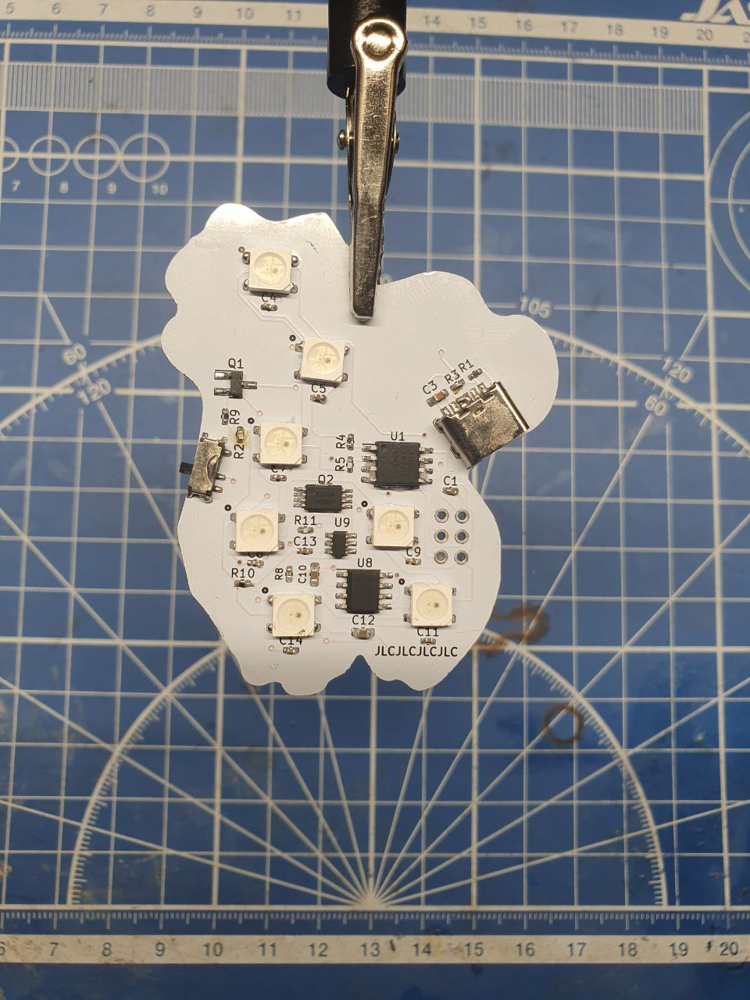

# Значки трайбов школы 21

Значки трайбов имеют 3 режима свечения, их можно перепрограммировать, 
так же у них имеется перезаряжаемый литиевый аккамулятор.

Значки не предназванчены для носки в мокрую и сырую погоду.
Будте осторожны с литиевыми аккумуляторами.

Программый код можно найти в папке glow_modes.
Схемы значков можно найти в pins.zip.

- Значки были разработаны в период с 02.23  по 04.23
- Запаены в период с 05.23  по 08.23
- Запрограммированы в период с 08.23  по 09.23
- Залиты в силикон в период с 10.23  по 02.24

## Alpaca

## Honey badger

## Capybara

## Salamander

P.S Дополнительная информация о проекте вскоре будет добавлена  на git.